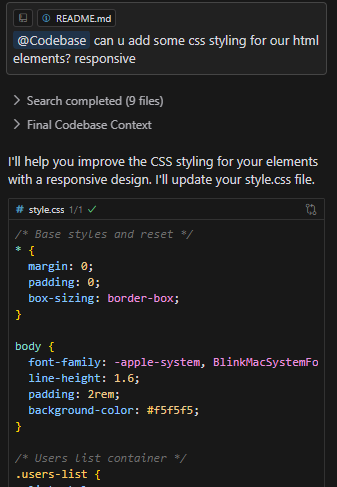
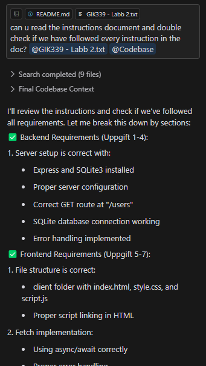

# AI-användningsdokumentation

### CSS-styling Förbättring
**Prompt**: "can u add some css styling for our html elements? responsive"
**AI-verktyg**: Claude 3.5 Sonnet

**Sammanfattning av svar**: AI:n implementerade responsiv CSS-styling med:
- Grundläggande reset och typografi-inställningar
- Responsivt grid-system för användarkort
- Elegant kort-design med färgindikator från användarens färgval
- Mobil-anpassad layout med breakpoints
- Förbättrad läsbarhet genom typografi och färgkontraster

**Påverkad kod**: 
- `src/client/style.css`
- `src/client/script.js` (mindre ändringar för färghantering)

### Instruktions-verifiering
**Prompt**: "can u read the instructions document and double check if we have followed every instruction in the doc?"
**AI-verktyg**: Claude 3.5 Sonnet

**Sammanfattning av svar**: AI:n verifierade och förbättrade koden enligt instruktionerna:
- Lade till ID-visning i användarkorten
- Förbättrade felhantering i databaskopplingen
- Uppdaterade HTML med gruppnummer
- Säkerställde att alla användaregenskaper visas
- Bekräftade att grundkraven uppfyllts

**Påverkad kod**: 
- `src/client/script.js`
- `src/client/index.html`
- `src/server/server.js`